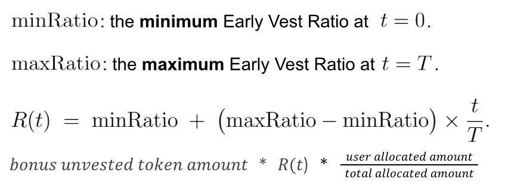

# Chainlink Rewards audit details
- Total Prize Pool: $200,000 in USDC
  - HM awards: up to $185,000 in USDC
    - If no valid Highs or Mediums are found, the HM pool is $0
  - QA awards: $7,500 in USDC
  - Judge awards: $7,000 in USDC
  - Scout awards: $500 in USDC
- [Read our guidelines for more details](https://docs.code4rena.com/roles/wardens)
- Starts June 16, 2025 20:00 UTC
- Ends July 16, 2025 20:00 UTC


### ❗️ Notes for auditors
1. **PoC required:** High- and Medium-risk submissions require a [coded, runnable Proof of Concept](https://docs.code4rena.com/competitions/submission-guidelines#required-proof-of-concept-poc-for-solidity-evm-audits).
1. **All submissions will be kept private:** The findings and report from this audit will remain private to the Chainlink team; the report will not be published publicly. [Wardens with the SR role](https://docs.code4rena.com/roles/sr-wardens) will be able to view submissions and participate in post-judging QA as usual, but all finding details, judge decisions, etc. will remain confidential. 
1. **Judging phase risk adjustments:**
    - High- or Medium-risk submissions downgraded to Low-risk (QA) will be ineligible for awards.
    - Upgrading a Low-risk finding from a QA report to a Medium- or High-risk finding is not supported.
    - As such, wardens are encouraged to select the appropriate risk level carefully during the submission phase.

## Automated findings / publicly known issues

The 4naly3er report can be found [here](https://github.com/code-423n4/2025-06-chainlink/blob/main/4naly3er-report.md).

_Note for C4 wardens: Anything included in this `Automated Findings / Publicly Known Issues` section is considered a publicly known issue and is ineligible for awards._

 - one claim contract per token. If a project redeploys token/has multiple tokens, new claim contracts should be deployed 
 - merkle proofs are only accessible through FE after user/delegate goes through the validations 
 (Terms of Service signing, wallet sanction & delegation checks, ..) 
 - zero adminRoleTransferDelay for the factory contract 
 - non-standard tokens or malicious build projects 
 - all role granted addresses should be assumed to be non-malicious 
 - someone makes a claim on behalf of another by reusing their regular claim merkle proofs

# Overview

[Chainlink Rewards (CLR)](https://blog.chain.link/chainlink-build-program/) is a community engagement and rewards program designed to incentivize active participation in the Chainlink Network. The contracts in this document are designed to allow projects in the [Chainlink Build program](https://chain.link/economics/build-program) (CLR projects) to deploy an on-chain claim mechanism of their tokens for Chainlink ecosystem participants.

## Links

- **Documentation:** [Chainlink Rewards Contracts Technical Design](https://github.com/code-423n4/2025-06-chainlink/ChainlinkRewardsContractsTechnicalDesign.pdf)
- **Website:** [chain.link](https://chain.link/)
- **X/Twitter:** [@chainlink](https://twitter.com/chainlink)

---

# Scope

*See [scope.txt](https://github.com/code-423n4/2025-06-chainlink/blob/main/scope.txt)*

### Files in scope

| File   | Logic Contracts | Interfaces | nSLOC | Purpose | Libraries used |
| ------ | --------------- | ---------- | ----- | -----   | ------------ |
| /src/BUILDClaim.sol | 1| **** | 262 | |chainlink/contracts/src/v0.8/shared/interfaces/ITypeAndVersion.sol<br>@openzeppelin/contracts/utils/introspection/IERC165.sol<br>@openzeppelin/contracts/token/ERC20/IERC20.sol<br>@openzeppelin/contracts/access/AccessControl.sol<br>@solmate/FixedPointMathLib.sol<br>@openzeppelin/contracts/token/ERC20/utils/SafeERC20.sol<br>@openzeppelin/contracts/utils/Pausable.sol<br>@openzeppelin/contracts/utils/ReentrancyGuard.sol<br>@openzeppelin/contracts/utils/cryptography/MerkleProof.sol|
| /src/BUILDFactory.sol | 1| **** | 364 | |chainlink/contracts/src/v0.8/shared/interfaces/ITypeAndVersion.sol<br>@openzeppelin/contracts/token/ERC20/extensions/IERC20Metadata.sol<br>@openzeppelin/contracts/utils/structs/EnumerableSet.sol<br>@solmate/FixedPointMathLib.sol<br>@delegatexyz/delegate-registry/v2.0/src/IDelegateRegistry.sol|
| **Totals** | **2** | **** | **626** | | |

### ✅ Scout TODOs:
- ✅ Scout to complete this using the `metrics.md` file
- ✅ Last row of the table should be Total: SLOC
- ✅ SCOUT: Have the sponsor review and and confirm in text the details in the section titled "Scoping Q &amp; A"

### Files out of scope

*See [out_of_scope.txt](https://github.com/code-423n4/2025-06-chainlink/blob/main/out_of_scope.txt)*

| File         |
| ------------ |
| ./lib/vendor/chainlink/v2.18.0/contracts/src/v0.8/shared/access/ConfirmedOwner.sol |
| ./lib/vendor/chainlink/v2.18.0/contracts/src/v0.8/shared/access/ConfirmedOwnerWithProposal.sol |
| ./lib/vendor/chainlink/v2.18.0/contracts/src/v0.8/shared/interfaces/IAccessController.sol |
| ./lib/vendor/chainlink/v2.18.0/contracts/src/v0.8/shared/interfaces/IOwnable.sol |
| ./lib/vendor/chainlink/v2.18.0/contracts/src/v0.8/shared/interfaces/ITypeAndVersion.sol |
| ./lib/vendor/delegatexyz/delegate-registry/v2.0/src/DelegateRegistry.sol |
| ./lib/vendor/delegatexyz/delegate-registry/v2.0/src/IDelegateRegistry.sol |
| ./lib/vendor/delegatexyz/delegate-registry/v2.0/src/libraries/RegistryHashes.sol |
| ./lib/vendor/delegatexyz/delegate-registry/v2.0/src/libraries/RegistryOps.sol |
| ./lib/vendor/delegatexyz/delegate-registry/v2.0/src/libraries/RegistryStorage.sol |
| ./lib/vendor/space-and-time/SpaceAndTime.sol |
| ./scripts/BaseScript.s.sol |
| ./scripts/EnvManager.s.sol |
| ./scripts/build-claim/DeployBUILDClaim.s.sol |
| ./scripts/build-claim/Deposit.s.sol |
| ./scripts/build-claim/MsigMultiSendClaims.s.sol |
| ./scripts/build-factory/AddProjects.s.sol |
| ./scripts/build-factory/DeployBUILDFactory.s.sol |
| ./scripts/build-factory/SetProjectSeasonConfig.s.sol |
| ./scripts/build-factory/SetSeasonUnlockStartTime.s.sol |
| ./scripts/erc20/DeployERC20Token.s.sol |
| ./scripts/scenarios/Scenario_SetupSepolia.s.sol |
| ./src/Closable.sol |
| ./src/ManagedAccessControl.sol |
| ./src/interfaces/IBUILDClaim.sol |
| ./src/interfaces/IBUILDFactory.sol |
| ./src/mocks/ERC20Token.sol |
| ./src/mocks/FeeOnTransferERC20Token.sol |
| ./src/mocks/InvalidTransferERC20Token.sol |
| ./src/mocks/MultiSendCallOnly.sol |
| ./src/mocks/Multicall3.sol |
| ./src/mocks/MultisigWallet.sol |
| ./src/mocks/ReentrantERC20Token.sol |
| ./test/BUILDClaim/BuildClaim._getClaimableState.scenarios.t.sol |
| ./test/BUILDClaim/BuildClaim.claim.t.sol |
| ./test/BUILDClaim/BuildClaim.deposit.t.sol |
| ./test/BUILDClaim/BuildClaim.getGlobalState.t.sol |
| ./test/BUILDClaim/BuildClaim.getUserState.t.sol |
| ./test/BUILDClaim/BuildClaim.scenarios.t.sol |
| ./test/BUILDClaim/BuildClaim.withdraw.t.sol |
| ./test/BUILDFactory/BUILDFactory.AcceptDefaultAdminTransfer.t.sol |
| ./test/BUILDFactory/BUILDFactory.AddProjects.t.sol |
| ./test/BUILDFactory/BUILDFactory.AddTotalDeposited.t.sol |
| ./test/BUILDFactory/BUILDFactory.BeginDefaultAdminTransfer.t.sol |
| ./test/BUILDFactory/BUILDFactory.CalcMaxAvailableAmount.sol |
| ./test/BUILDFactory/BUILDFactory.CancelDefaultAdminTransfer.t.sol |
| ./test/BUILDFactory/BUILDFactory.CancelWithdraw.t.sol |
| ./test/BUILDFactory/BUILDFactory.Close.t.sol |
| ./test/BUILDFactory/BUILDFactory.DeployClaim.t.sol |
| ./test/BUILDFactory/BUILDFactory.EmergencyPause.t.sol |
| ./test/BUILDFactory/BUILDFactory.EmergencyUnpause.t.sol |
| ./test/BUILDFactory/BUILDFactory.ExecuteWithdraw.t.sol |
| ./test/BUILDFactory/BUILDFactory.GetRefundableAmount.t.sol |
| ./test/BUILDFactory/BUILDFactory.GetSeasonConfig.t.sol |
| ./test/BUILDFactory/BUILDFactory.GetTokenAmounts.t.sol |
| ./test/BUILDFactory/BUILDFactory.PauseClaimContract.t.sol |
| ./test/BUILDFactory/BUILDFactory.ReduceRefundableAmount.t.sol |
| ./test/BUILDFactory/BUILDFactory.RemoveProjects.t.sol |
| ./test/BUILDFactory/BUILDFactory.ScheduleWithdraw.t.sol |
| ./test/BUILDFactory/BUILDFactory.SetProjectSeasonConfig.t.sol |
| ./test/BUILDFactory/BUILDFactory.SetSeasonConfig.t.sol |
| ./test/BUILDFactory/BUILDFactory.SetUnlockConfigMaxValues.t.sol |
| ./test/BUILDFactory/BUILDFactory.StartRefund.t.sol |
| ./test/BUILDFactory/BUILDFactory.UnpauseClaimContract.t.sol |
| ./test/BUILDFactory/BUILDFactory.setDelegateRegistry.t.sol |
| ./test/BUILDFactory/BuildFactory.constructor.t.sol |
| ./test/BaseTest.t.sol |
| ./test/Constants.t.sol |
| ./test/ScenarioBuilder.t.sol |
| ./test/Utils.t.sol |
| ./test/gas/Gas_BUILDClaim.t.sol |
| ./test/gas/Gas_BUILDFactory.t.sol |
| ./test/invariants/BUILDClaim.invariants.t.sol |
| ./test/invariants/BUILDFactory.invariants.t.sol |
| ./test/invariants/BaseInvariant.t.sol |
| ./test/invariants/handlers/Handler.t.sol |
| Totals: 76 |

## Scoping Q&A

| Question | Answer |
| ---------------| ------------- |
| ERC20 used by the protocol |  |
| ERC721 used by the protocol |	None |
| ERC777 used by the protocol |	None |
| ERC1155 used by the protocol | None |
| Chains the protocol will be deployed on	| Ethereum only |

### EIP compliance checklist 
 - The project tokens that interact with BUILDClaim should comply with EIP-20 
 - BUILDClaim: EIP-165

# Additional context

## Areas of concern (where to focus for bugs)
 The team's largest concerns with the Chainlink Rewards S1 protocol are around: 
 -   Integrity of the allocation and claim mechanism( ie can members successfully allocate 
 their cubes and then claim their reward tokens?) 
 -   Can projects successfully deploy their build claim contract? 
 -   Does a rewards member earn the correct amount of rewards at all times? 
 -   Are any rewards locked into contracts? 
 -   Does multi season claiming work correctly? 
 -   Does early vesting work correctly, in particular a staker cannot have their tokens early 
 vested by another party? 
 -   Does delegation work correctly? 

 Access controls: 
 -   Are all access control modifiers implemented correctly and working as expected? 
 -   Can addresses other than the admin access admin only functions? This includes 
 setting configuration, adding projects, removing projects, deploying claims 
 -   Can addresses other than the pauser pause or unpause the contract. 
 -   Can addresses other than a claimant claim rewards, particularly early vest which causes 
 forfeiting of rewards. 
 -   If a project goes rogue, does the access control limit the damage it can be done by the

## Main invariants

- More than the max token amount cannot be claimed 
- The claimable and refundable amount never exceeds the token balance. 
- The factory’s maxAvailableAmount never exceeds the token balance. 
- There are secondary variants: 
  - total refunded never exceeds the total allocated 
  - total withdrawn never exceeds the total deposited 
  - total withdrawn never exceeds the max possible withdrawn amount 
  - total deposited and refunded amount always equals exceeds total allocated and 
  withdrawn amount 
  - total refunded amount never exceeds total allocated to all seasons 
  - total withdrawn amount never exceeds total deposited amount 
  - total withdrawn amount never exceeds max possible withdrawable amount 
  - total deposited and refunded amount always equals or exceeds total allocated 
  and withdrawn amount 

## All trusted roles in the protocol

| Role                                | Description                    |
| ----------------------------------- | ------------------------------ |
| Factory admin                       |                 |
| Project admin                       |                 |
| Pauser                              |                 |
| Claimant                            |                 |

## Describe any novel or unique curve logic or mathematical models implemented in the contracts:
Users can one time only “early vest” and receive a portion of their unvested tokens. They receive an amount that is proportional to the time remaining in a linear increasing band, i.e.



✅ SCOUT: please replace the above image with LaTeX.

## Running tests

- pnpm test:solidity 
- pnpm gas

✅ SCOUT: format the response above 👆 using the template below👇

```bash
git clone https://github.com/code-423n4/2023-08-arbitrum
git submodule update --init --recursive
cd governance
foundryup
make install
make build
make sc-election-test
```
To run code coverage
```bash
make coverage
```

✅ SCOUT: Add a screenshot of your terminal showing the test coverage

## Miscellaneous
Employees of Chainlink and employees' family members are ineligible to participate in this audit.

Code4rena's rules cannot be overridden by the contents of this README. In case of doubt, please check with C4 staff.
